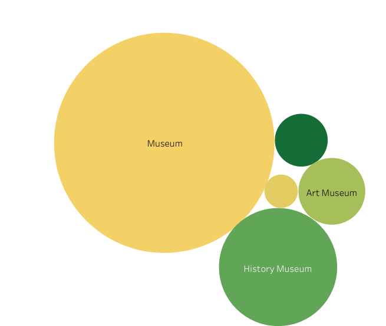

Final Project - 

NEXTstop-	User based recommender application to find places of interest in the country of Canada

Data- 
	Ticket Master API,  Yelp fusion API, FourSquare API 
 

    

        
    

Purpose-
	 To deploy a model to return places in a city in Canada with events and business around in a small radius , with ratings (preferable the top buisinesses ). The idea behind is to create an application to assist a user in creating an itenirary  based on the users history of ratings and also suggest some other things of interest based on other users.
 
 In the following image you can see the area covered within this dataset 

  

    

        
    

  

Main aim - 
	To be able to retrieve data from API's and parse json files. Distinguish between relevant important data from all the information available. 
	Build a recommender system 
	Work with deployement of an application using streamlit.io
 
 Tech Stack used - 
 <blockquote>
 	<t>
Pandas: Used for data manipulation and analysis.
</t>
 	
NumPy: Utilized for numerical computing and array operations.

 	
Matplotlib: Employed for data visualization and plotting.

	
NLTK (Natural Language Toolkit): Used for natural language processing tasks such as text analysis and tokenization.

	
Streamlit: Utilized for building interactive web applications for data visualization and user interaction

 </blockquote>
 

This application in its initial stages covers only a few categories with a relatively small group. 

TicketMaster API consistes of events accross the couuntry mainly focusing on sports and music, however those categories are further subdivided. Age restriction information was acquired from additional information column using NLTK library which can be found in the 'EDA TicketMaster.ipynb'
  

    

        
    

FourSquare APi was used to find places of interest based on venues found from TicketMaster API as reference. At this moment the concentration of category was only for museums. We ca also see how those are distributed accross various provinces

 

    

	  
        
    

Yelp fusion API using latitude and longitude from TicketMaster data was able to retrive restaurants in the area. Using business information I was also able to get user and reviews information for each and every venue gathered from all 3 API's. 

 

    

	  
    

 
